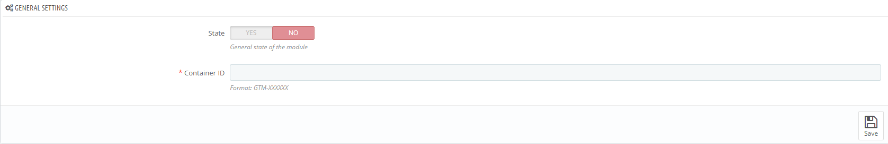
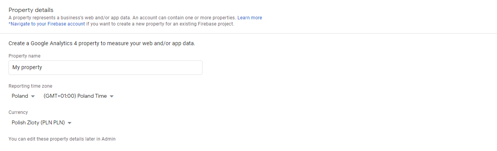
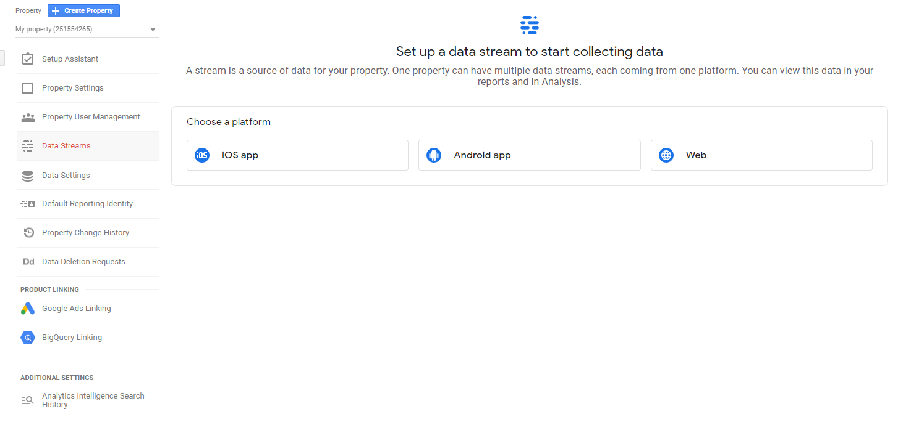
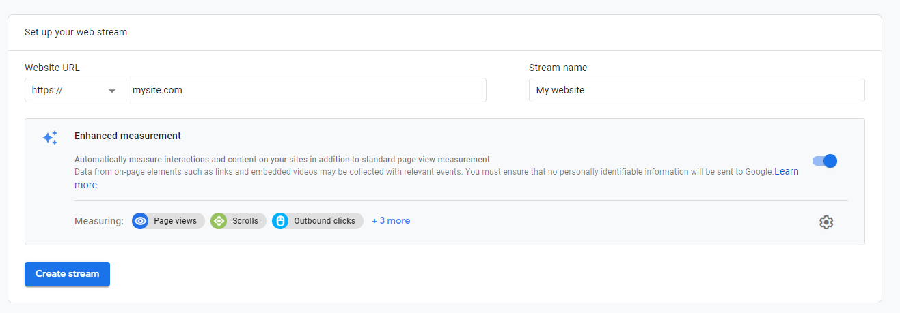
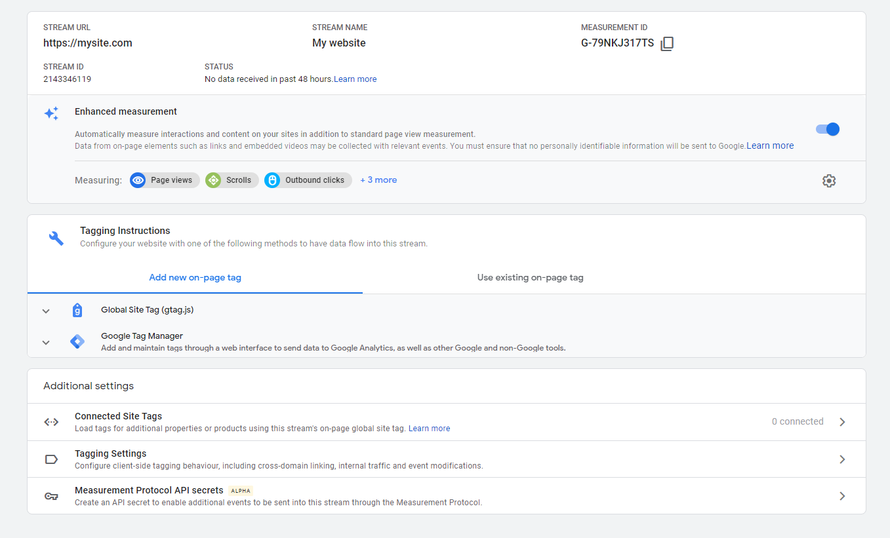

  
# tracksmart-prestashop [](https://travis-ci.com/kacperduras/tracksmart-prestashop)

Module to enhanced tracking for Google Analytics 4 (via Google Tag Manager).

## Advantages of module
* Very light (no unnecessary libraries)
* Efficient (no database queries)
* Scrupulous (sends necessary information in the correct formats)
* Flexible (e.g.: implementations for Facebook Pixel, simple API in JavaScript, and more)
* Open source

## Features
* Categories page view
* Products page view
* Products added to cart
* Products removed from cart
* Checkout
* Purchase

*Google Tag Manager settings provided in module, include example implementations for Google Analytics 4 and Facebook Pixel.*

## Requirements
* PrestaShop 1.7+
* PHP 7+

## How to set up?

### PrestaShop
* Download files from releases
* Install in PrestaShop
* Provide Container ID from GTM, mark as ready and save :)



### Google Analytics 4

* Create new property (select target country and currency)



* Set up new data stream: `Web`



* Provide details



* Save `Measurement ID`



### Facebook Pixel

Create and get ID of Facebook Pixel: [here](https://www.facebook.com/business/help/952192354843755)

### Google Tag Manager

* Set up settings from `container.json` file ([help is available here](https://support.google.com/tagmanager/answer/6106997?hl=en)).
* Replace values in variables:
  - `(Settings) Google Analytics` to `Measurement ID`
  - `(Settings) Facebook Pixel` to ID of Facebook Pixel
* Push tags. Done :)

## API

### JSON
* Request URL: `http://yoursite.com/module/tracksmart/ajax`
* Request body:
  - id: id of [Product](https://github.com/PrestaShop/PrestaShop/blob/1.7.7.x/classes/Product.php) (required)
  - attribute: attribute of [Product](https://github.com/PrestaShop/PrestaShop/blob/1.7.7.x/classes/Product.php)
  - customization: customization of [Product](https://github.com/PrestaShop/PrestaShop/blob/1.7.7.x/classes/Product.php)
* Response:
```json
{
  "item_name": "Item name",
  "item_id": 12345,
  "price": 12.34,
  "item_brand": "Brand",
  "item_category": "Category",
  "item_variant": "Variant",
  "quantity": 1
}
```
* Exceptions:
  - 400: `Bad Request`
  
### JavaScript

In `header`, module create instance of `TrackSmart` as variable `trackSmart`.

```javascript
let trackSmart = new TrackSmart('CONTAINER_ID', 'USER_ID'); // 'USER_ID' is optional
trackSmart.build(); // Initialize connection
trackSmart.process('event_name', {
    ecommerce: 'event_body'
}); // Send request to Google Tag Manager
trackSmart.destroy(); // Destroy session
```

## License
[GNU General Public License v3.0](LICENSE)
